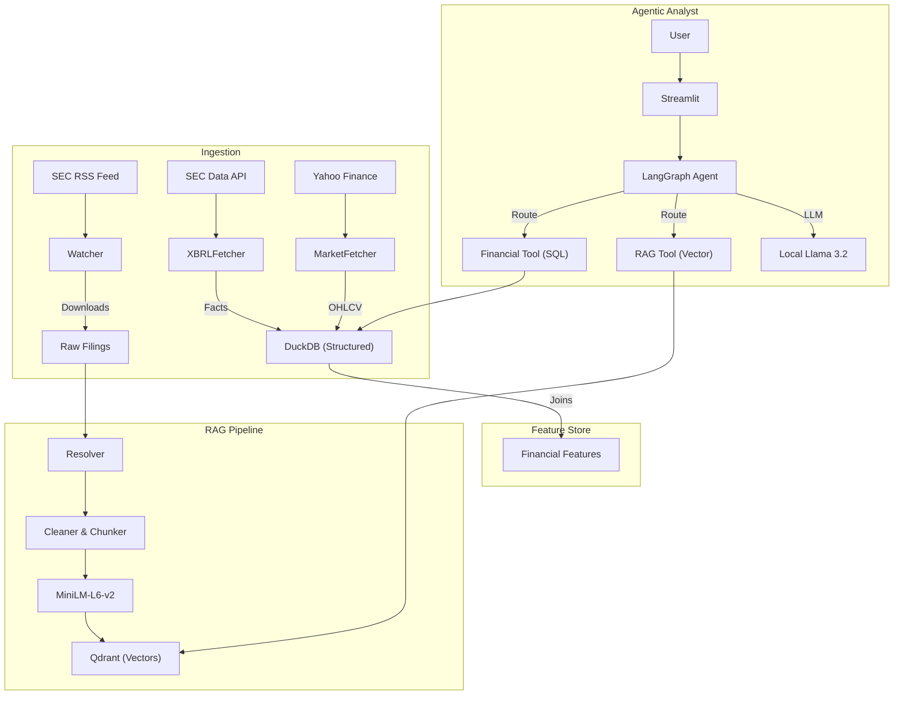

# EDGAR AlphaOps — Agentic Financial Intelligence & Risk Radar

> A fully open-source platform that continuously ingests SEC filings, computes rigorous DS outputs (event studies, risk scoring), and serves a grounded analyst copilot using GraphRAG and LangGraph.

## 🚀 Status
**Build Status:** [](https://github.com/kaushikkumarkr/EDGAR-AlphaOps/actions)

## 🏗 Architecture



## 🛠 Tech Stack
- **Lakehouse:** DuckDB (SQL + Parquet)
- **Vector Store:** Qdrant
- **Agent Orchestration:** LangGraph, LangChain
- **LLM Serving:** MLX (Local on Apple Silicon)
- **Frontend:** Streamlit
- **Observability:** Phoenix (Tracing)

## 🏃 Quick Start

### Prerequisites
- Docker & Docker Compose
- Python 3.11+
- Apple Silicon Mac (for MLX optimization)

### 1. Infrastructure Setup
```bash
# Clone the repo
git clone https://github.com/kaushikkumarkr/EDGAR-AlphaOps.git
cd EDGAR-AlphaOps

# Setup Environment
cp .env.example .env
# EDIT .env: Set SEC_USER_AGENT="Your Name (email@example.com)"

# Start Qdrant & Phoenix
make up
```

### 2. Python Environment
```bash
make install
```

### 3. Start Local LLM Server
Open a new terminal and run:
```bash
make serve_llm
# This downloads/serves mlx-community/Llama-3.2-3B-Instruct-4bit on port 8080
```

### 4. Data Ingestion (Demo)
Ingest sample data for analysis (e.g., AVAH, AAPL, MSFT):
```bash
# Ingest Historical Market Data & XBRL Facts
make ingest_market && make build_features

# Ingest & Index SEC Filing for RAG (Demo: AVAH)
make ingest_rag
```

### 5. Launch Analyst UI
```bash
make run_ui
# Access at http://localhost:8501
```

## 🧪 Verification
Run the end-to-end integration test:
```bash
python tests/test_agent_integrated.py
```

## 📂 Project Structure
```
/apps          # CLI and Streamlit UI
/agents        # LangGraph Agent logic
/pipelines     # Ingestion (SEC, Market, RAG)
/lakehouse     # DuckDB schemas and Feature logic
/data          # Local data storage (DuckDB, Filings)
/tests         # Test suite
```

## 📜 License
MIT
