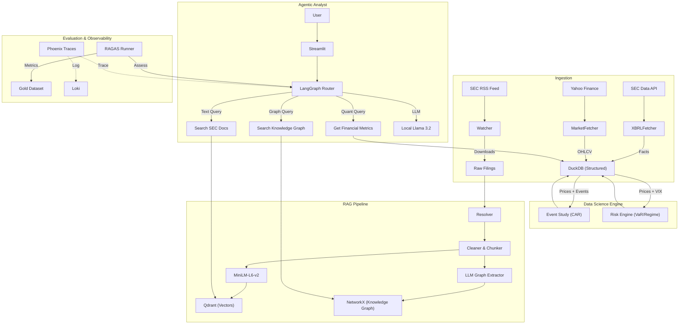

# EDGAR AlphaOps — Agentic Financial Intelligence & Risk Radar

> A fully open-source platform that continuously ingests SEC filings, computes rigorous DS outputs (event studies, risk scoring), and serves a grounded analyst copilot using GraphRAG and LangGraph.

## 🚀 Status
**Build Status:** [](https://github.com/kaushikkumarkr/EDGAR-AlphaOps/actions)

## 🏗 Architecture



## 🛠 Tech Stack

### 🧠 Core AI & Agents
- **Orchestration**: `LangGraph` (Cyclic State Graphs), `LangChain`
- **LLM Serving (Local)**: `MLX` (Apple Silicon optimized Llama 3)
- **LLM Serving (Cloud)**: `Groq` (Planned for Sprint M4)
- **RAG**: Hybrid (Vector + Knowledge Graph)
- **Embeddings**: `sentence-transformers/all-MiniLM-L6-v2`

### 💾 Data & Storage (Hybrid)
- **Lakehouse (SQL)**: `DuckDB` (Local) / `MotherDuck` (Cloud)
- **Vector Store**: `Qdrant` (Local Docker) / `Qdrant Cloud`
- **Graph Store**: `DuckDB` (Adjacency Lists) + `NetworkX`

### 📊 Data Science Engine
- **Event Studies**: `scipy.stats`, `statsmodels` (OLS Regression)
- **Risk Models**: `numpy` (VaR), `pandas` (TimeSeries)
- **Sources**: SEC EDGAR (RSS/API), Yahoo Finance (`yfinance`)

### 🛡 Ops & Observability
- **Evaluation**: `RAGAS` (LLM-as-a-judge pipeline)
- **Tracing**: `Langfuse` (Production), `Arize Phoenix` (Local Dev)
- **Infrastructure**: Docker Compose, GitHub Actions
- **Frontend**: Streamlit

## 🏃 Quick Start

### Prerequisites
- Docker & Docker Compose
- Python 3.11+
- Apple Silicon Mac (for MLX optimization)

### 1. Infrastructure Setup
```bash
# Clone the repo
git clone https://github.com/kaushikkumarkr/EDGAR-AlphaOps.git
cd EDGAR-AlphaOps

# Setup Environment
cp .env.example .env
# EDIT .env: Set SEC_USER_AGENT="Your Name (email@example.com)"

# Start Qdrant & Phoenix
make up
```

### 2. Python Environment
```bash
make install
```

### 3. Start Local LLM Server
Open a new terminal and run:
```bash
make serve_llm
# This downloads/serves mlx-community/Llama-3.2-3B-Instruct-4bit on port 8080
```

### 4. Data Ingestion & Indexing
Ingest sample data for analysis (e.g., AAPL):
```bash
# 1. Market Data & XBRL
make ingest_market TICKERS=AAPL,SPY,^VIX
make ingest_xbrl TICKERS=AAPL

# 2. RAG Pipelines (Vector + Graph)
make build_index TICKERS=AAPL
make build_graph TICKERS=AAPL
```

### 5. Run Data Science Engines
Compute quantitative metrics:
```bash
make compute_ds TICKERS=AAPL    # Event Studies (Alpha/Beta/CAR)
make compute_risk TICKERS=AAPL  # Risk Models (VaR/Regime)
```

### 6. Launch Analyst UI
```bash
make run_ui
# Access at http://localhost:8501
```

## 🔭 Observability & Evaluation
- **Tracing**: Access Phoenix UI at `http://localhost:6006` to see full trace of every LLM call.
- **Evaluation**: Run the RAGAS suite against the Gold Dataset:
```bash
make eval
# Output: artifacts/eval/report.csv
# Note: Requires OPENAI_API_KEY for Ragas metrics.
```

## 📂 Project Structure
```
/apps          # CLI and Streamlit UI
/agents        # LangGraph Agent logic
/ds            # Data Science Engines (Event Study, Risk)
/rag           # RAG Pipelines (Vector)
/pipelines     # Ingestion (SEC, Market, Graph)
/lakehouse     # DuckDB schemas
/eval          # Evaluation Datasets & Pipelines
/observability # Tracing Config
/tests         # Test suite
```

## 📜 License
MIT
