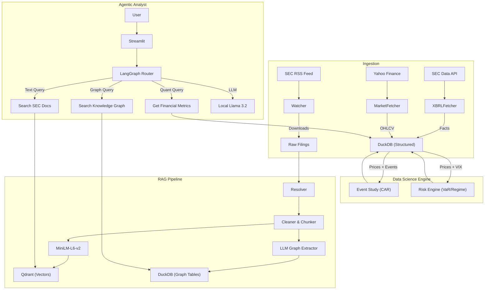

# EDGAR AlphaOps — Agentic Financial Intelligence & Risk Radar

> A fully open-source platform that continuously ingests SEC filings, computes rigorous DS outputs (event studies, risk scoring), and serves a grounded analyst copilot using GraphRAG and LangGraph.

## 🚀 Status
**Build Status:** [](https://github.com/kaushikkumarkr/EDGAR-AlphaOps/actions)

## 🏗 Architecture



## 🛠 Tech Stack
- **Lakehouse:** DuckDB (SQL + Parquet)
- **Vector Store:** Qdrant
- **Agent Orchestration:** LangGraph, LangChain
- **GraphRAG:** NetworkX / SQL Adjacency
- **DS Engine:** Pandas, Scipy (Regression, VaR)
- **LLM Serving:** MLX (Local on Apple Silicon)
- **Eval:** RAGAS (Lite)
- **Frontend:** Streamlit
- **Observability:** Phoenix (Tracing)

## 🏃 Quick Start

### Prerequisites
- Docker & Docker Compose
- Python 3.11+
- Apple Silicon Mac (for MLX optimization)

### 1. Infrastructure Setup
```bash
# Clone the repo
git clone https://github.com/kaushikkumarkr/EDGAR-AlphaOps.git
cd EDGAR-AlphaOps

# Setup Environment
cp .env.example .env
# EDIT .env: Set SEC_USER_AGENT="Your Name (email@example.com)"

# Start Qdrant & Phoenix
make up
```

### 2. Python Environment
```bash
make install
```

### 3. Start Local LLM Server
Open a new terminal and run:
```bash
make serve_llm
# This downloads/serves mlx-community/Llama-3.2-3B-Instruct-4bit on port 8080
```

### 4. Data Ingestion & Indexing
Ingest sample data for analysis (e.g., AAPL):
```bash
# 1. Market Data & XBRL
make ingest_market TICKERS=AAPL,SPY,^VIX
make ingest_xbrl TICKERS=AAPL

# 2. RAG Pipelines (Vector + Graph)
make build_index TICKERS=AAPL
make build_graph TICKERS=AAPL
```

### 5. Run Data Science Engines
Compute quantitative metrics:
```bash
make compute_ds TICKERS=AAPL    # Event Studies (Alpha/Beta/CAR)
make compute_risk TICKERS=AAPL  # Risk Models (VaR/Regime)
```

### 6. Launch Analyst UI
```bash
make run_ui
# Access at http://localhost:8501
```

## 🧪 Evaluation
Run the RAGAS-based evaluation suite on the Gold Dataset:
```bash
make eval
# Output: artifacts/eval/report.json
```

## 📂 Project Structure
```
/apps          # CLI and Streamlit UI
/agents        # LangGraph Agent logic
/ds            # Data Science Engines (Event Study, Risk)
/rag           # RAG Pipelines (Vector, GraphRAG)
/pipelines     # Ingestion (SEC, Market)
/lakehouse     # DuckDB schemas
/eval          # Evaluation Datasets & Pipelines
/observability # Tracing Config
/tests         # Test suite
```

## 📜 License
MIT
